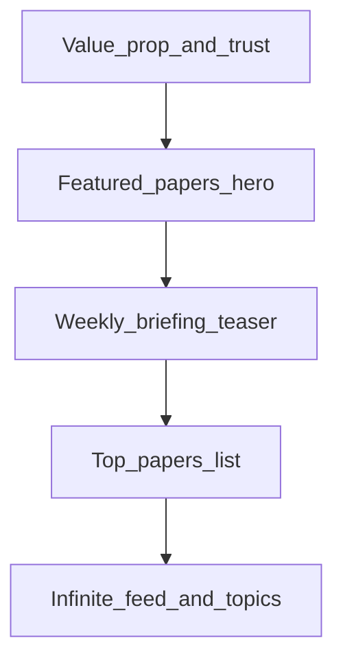

# Ground News homepage analysis and PaperBites blueprint

This document describes how [Ground News](https://ground.news) structures its homepage for clarity, trust, and scanning behavior, and how PaperBites can reuse that **information architecture** while keeping research-specific content (papers, topics, skim modes).

---

## Executive summary: Ground News homepage (section order)

The homepage reads as a **vertical stack** of repeating templates. At a high level, the **first screen** establishes the product, then **one marquee story**, then a **digest module**, then **ranked lists** and **topic hubs**.

| Order | Section | Role |
| ----- | ------- | ---- |
| 1 | **Value proposition** | Headline plus one line on the product’s purpose (e.g. multiple perspectives, understanding bias). Sets expectations before any article list. |
| 2 | **Featured / “As featured on”** | One dominant story with imagery and headline. **Credibility signals** sit next to the story: geography, outlet names, and a **Left / Center / Right** spectrum with **source counts** (e.g. “N / M sources”). |
| 3 | **Daily Briefing** | Compact digest: **metrics first** (stories × articles × read time), a **lead item** with short context, **teaser bullets** for more headlines, link to the full briefing (`/daily-briefing`). |
| 4 | **Top News Stories** | **Ranked list** of headlines; each row adds **one differentiated metadata line** (e.g. coverage skew + number of sources), not the title alone. |
| 5 | **Top News (dated)** | Larger cards with images; same spectrum/coverage framing as smaller rows. |
| 6 | **Personalized / niche rails** | e.g. “My News Bias,” “Blindspots”—editorial or algorithmic angles with short explanations. |
| 7 | **Topic hubs** | Sections such as local news, regional or thematic topics. Each hub typically includes: **hero feature**, **niche sub-rail** (e.g. “Blindspots”), **latest list**, **“Read more [topic]”** CTA. |
| 8 | **Long tail** | More stories, similar list/card patterns, “More stories” style continuation. |

**Core narrative above the fold:** *promise → proof (featured story + breadth) → digest (briefing).* Everything after that repeats a familiar **section template** (heading + optional hero + list + optional CTA).

---

## UX pattern notes

### Hierarchy and scannability

- **Section titles are explicit** (“Daily Briefing,” “Top News Stories”). Users can jump by heading without reading every card.
- **One primary metric per row** keeps rows scannable: Ground News often uses **coverage / spectrum + source count** as that line; it is instantly comparable across stories.
- **Digest modules front-load utility**: story count, article count, and estimated read time appear **before** the lead paragraph so users decide whether to commit.

### Trust and differentiation

- **Numbers as proof**: source counts and spectrum labels signal “we aggregated many outlets,” which supports the brand promise.
- **Featured placement** is not arbitrary—the top story carries **visual weight** and **social proof** together.

### Repetition as a system

- Topic hubs reuse the **same building blocks** (hero + special rail + latest + read more). That keeps the page long but **learnable**: once you understand one hub, you understand the rest.

### What to borrow vs. avoid for a research product

- **Borrow:** Clear section order; one **digest** band; **ranked list** with a **single secondary metadata line** per item; strong **hero** for “why open this.”
- **Avoid blindly:** Political spectrum UI unless it matches your data model; endless topic hubs on v1 if your core loop is **feed + topics + paper detail**.

---

## PaperBites adaptation

Target order for your app (aligned with the plan): **something compelling at the top → weekly briefing → top papers → deeper browsing.**

### 1. Top of page: “something very interesting”

**Ground News analog:** Value proposition + featured story + proof (sources / spectrum).

**PaperBites direction:**

- Keep the **promise** in the dashboard / hero area: why someone should use PaperBites (fast skimming, role lens, open source only when it matters). Today this lives in `StickyScrollDashboard` on the home page (`apps/web/app/page.tsx`).
- Use **FeedHero** (`apps/web/components/feed-hero.tsx`) as the **marquee** (currently a three-up grid of featured papers with image, takeaway, lens, read time). Optionally evolve toward **one** oversized hero paper if you want stronger parity with Ground’s single “featured” story.
- Add or emphasize **one proof line per hero item** where you have data: e.g. recency, journal, study design badge, citation signal—your equivalent of “N sources.”

### 2. Weekly briefing

**Ground News analog:** Daily Briefing module (metrics + lead + bullets + link to full page).

**PaperBites direction:**

- Insert an explicit **“This week” / Weekly briefing** band that **teases** content from the last seven days, with:
  - **Metrics** if available (e.g. number of papers, estimated read time for the digest).
  - **One lead paper** (title + one-line takeaway).
  - **1–2 teaser lines** for additional items or themes (“+ … and more”).
  - **CTA** to the full weekly view: `apps/web/app/weekly/page.tsx`, backed by `loadWeeklyFeed()` in `apps/web/app/feed-data.ts`.

Placement options (choose one when implementing UI):

- Between **StickyScrollDashboard** and **FeedHero**, or  
- Between **FeedHero** and the **infinite feed**, if you want the hero to stay the first “content” block.

### 3. Top papers published

**Ground News analog:** “Top News Stories” ranked list with a metadata line per row.

**PaperBites direction:**

- Add a **ranked list** (e.g. top 5–10) **separate** from the 3-up hero and from the infinite grid. Each row:
  - **Title** (link to `/papers/[slug]`).
  - **One secondary line**: journal, year, topic tags, or study-design badge—whatever best matches your `PaperRecord` and product story.
- Below that, keep the **infinite feed** for breadth (`InfiniteFeed` on the home page).

This mirrors Ground’s distinction between **curated top list** and **long tail**.

### 4. Existing pieces to preserve

- **Topic filters** as horizontal chips on the home page are your lightweight alternative to Ground’s many topic hubs; no need to replicate hub-per-topic on day one.
- **Skim mode** (`SkimModeSwitcher`) stays part of the toolbar / dashboard pattern you already use on home and weekly pages.

### Information flow (reference)

---

## Optional content checklist (per block)

Use this when writing copy or wiring data.

| Block | Copy | Data |
| ----- | ---- | ---- |
| Value prop / dashboard | Eyebrow, title, one short description | None beyond static text; optional topic context when `?topic=` is set |
| Featured hero | Section eyebrow (e.g. “Latest highlights”) | First N papers from `loadFeedPage` (today N=3 for hero) |
| Weekly briefing teaser | Headline for the week, CTA label | Subset or summary from `loadWeeklyFeed()` |
| Top papers list | Section title (“Top papers” or similar) | Ranked list—define ranking (e.g. editorial, score, recency) from feed API or shared types |
| Infinite feed | — | `InfiniteFeed` initial cursor and topic |

---

## References

- Ground News homepage: [https://ground.news](https://ground.news)
- PaperBites home: `apps/web/app/page.tsx`
- Weekly page: `apps/web/app/weekly/page.tsx`
- Feed data loaders: `apps/web/app/feed-data.ts`
- Hero UI: `apps/web/components/feed-hero.tsx`

---

*This blueprint is documentation only; it does not change application behavior until you implement the corresponding UI and data wiring.*
